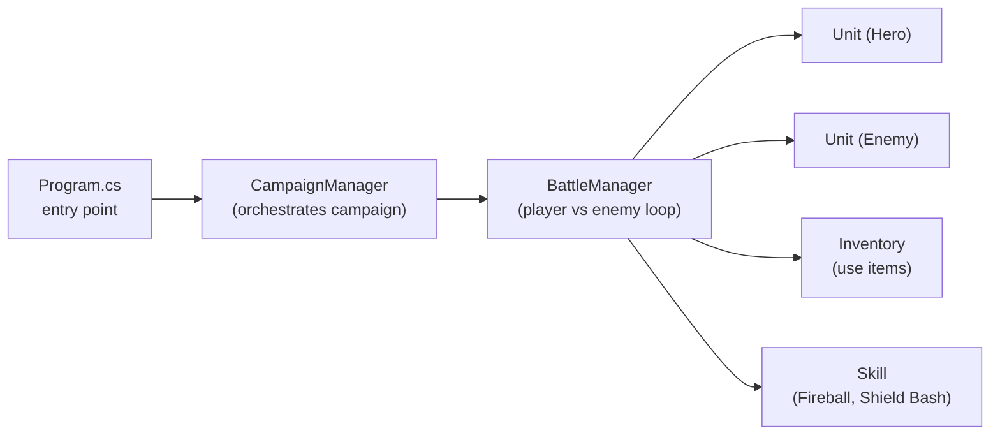

# Turn-Based Battle Game ⚔️

## **Overview**

A console-based **C#**/**.NET** turn-based battle simulator where a **Hero** fights through a multi-battle **campaign** against a **Goblin**, **Orc**, and **Dragon**. The game showcases clean OOP design (Units, Skills, Inventory), a battle loop with player choices, basic enemy AI, and a simple campaign progression system. &#x20;

---

## **Key Features**

* **Core Turn System** – Player chooses **Attack**, **Heal**, **Use Skill**, or **Use Item** each round; then the enemy takes a turn.&#x20;
* **Skills** – Built-in skills: **Fireball** (applies a *Burn* status flag) and **Shield Bash** (*Stun*). Stun is enforced in the turn loop (enemy skips its next turn). Burn is recorded as a status for future DOT extensions. &#x20;
* **Inventory & Items** – A simple dictionary-backed inventory with **Health Potions** that trigger unit healing; includes listing and use logic.&#x20;
* **Campaign Mode** – Sequential battles vs **Goblin → Orc → Dragon**, with a post-fight **potion reward** and campaign victory/defeat handling.&#x20;
* **Unit Model** – HP, attack power, heal power, status effect handling; randomized damage/heal rolls; death checks.&#x20;

---

## **Architecture**



* **Program.cs** wires the game: creates the Hero, seeds the inventory, and launches the campaign.&#x20;
* **CampaignManager** sequences enemies and grants post-fight rewards.&#x20;
* **BattleManager** runs the interactive loop and enemy AI (attack/heal, with stun skip).&#x20;
* **Inventory** and **Skill** provide composable actions. &#x20;

---

## **Gameplay Loop (from code)**

```text
Hero HP: 100 | Goblin HP: 70
Player's turn! Choose an action:
1. Attack
2. Heal
3. Use Skill
4. Use Item
```

* **Attack** – Randomized damage based on attack power.&#x20;
* **Heal** – Randomized heal up to max HP.&#x20;
* **Use Skill** – `Fireball` applies **Burn** (status flag); `Shield Bash` applies **Stun** (enemy’s next turn is skipped, then status cleared). &#x20;
* **Use Item** – Choose an item (e.g., **Health Potion**) from the inventory to heal.&#x20;

> Enemy AI: if **Stunned**, it **skips**; otherwise chooses between **Attack** or **Heal** randomly.&#x20;

---

## **Project Structure**

```
.
├─ Program.cs                 # Entry point (creates Hero, seeds inventory, starts campaign)
├─ CampaignManager.cs         # Enemy sequence, rewards, victory/defeat flow
├─ BattleManager.cs           # Per-battle loop: choices, enemy AI, status handling
├─ Unit.cs                    # Unit stats, attack/heal RNG, status flags, death checks
├─ Skill.cs                   # Fireball (Burn), Shield Bash (Stun)
├─ Inventory.cs               # Items dict, use/list logic (Health Potion)
└─ Turn_Based_Battle.csproj   # .NET project file
```

Cited from the implementation: Program, CampaignManager, BattleManager, Unit, Skill, and Inventory.     &#x20;

---

## **How to Run**

> Requires **.NET SDK 9.0** (project targets `net9.0`, per build output path).

```bash
# from the project directory (where the .csproj lives)
dotnet restore
dotnet run
```

Or build and run explicitly:

```bash
dotnet build -c Release
dotnet bin/Release/net9.0/Turn_Based_Battle.dll
```

---

## **Design Notes**

* **Randomized Combat** – Damage and healing use a simple RNG range around base power to keep encounters varied.&#x20;
* **Status Effects** – `Stun` is **fully enforced** in the loop (skip then clear). `Burn` is **tracked** as a status flag (and logged) and is ideal for a future damage-over-time tick. &#x20;
* **Campaign Pacing** – Three escalating enemies with a **potion reward** after each victory keeps resource pressure meaningful.&#x20;

---

## **API (Core Classes)**

* **`Unit`**

  * Props: `Hp`, `IsDead`, `StatusEffect`, `UnitName`
  * Methods: `Attack(Unit)`, `TakeDamage(int)`, `Heal()`, `ApplyStatusEffect(string)`, `ClearStatusEffect()`.&#x20;

* **`Skill`**

  * `Use(Unit caster, Unit target)` → applies damage and optional status (`Burn`/`Stun`).&#x20;

* **`Inventory`**

  * `AddItem(name,count)`, `UseItem(name, target)`, `ShowInventory()`. **Health Potion** triggers `Unit.Heal()`.&#x20;

* **`BattleManager`**

  * `StartBattle()` → player command loop; AI + status handling; victory/defeat prints.&#x20;

* **`CampaignManager`**

  * `StartCampaign(Unit, Inventory)` → Goblin → Orc → Dragon; reward potions.&#x20;

---

## **Sample Session**

```text
A wild Goblin appears!
Hero HP: 100 | Goblin HP: 70
Player's turn! Choose an action:
1. Attack
2. Heal
3. Use Skill
4. Use Item
...
Enemy's turn!
Goblin attacks Hero for 15 damage!
...
Victory! You defeated the enemy.
You defeated the Goblin! Prepare for the next battle.
```

(Directly aligned with the console prompts and flow in `BattleManager.StartBattle()` and `CampaignManager.StartCampaign()`.) &#x20;

---

## **Roadmap**

* **DOT engine** for **Burn** (apply damage at round start).
* **Status system** upgrade (stacking buffs/debuffs, durations).
* **Leveling & XP**, enemy scaling, more skills/items.
* **Save/Load** runs; rich **GUI** (WinForms/WPF/MAUI) on top of the same core.

---

## **Author**

**Daryll Giovanny Bikak Mbal** — showcasing C# OOP, simple AI, and game-loop design.
